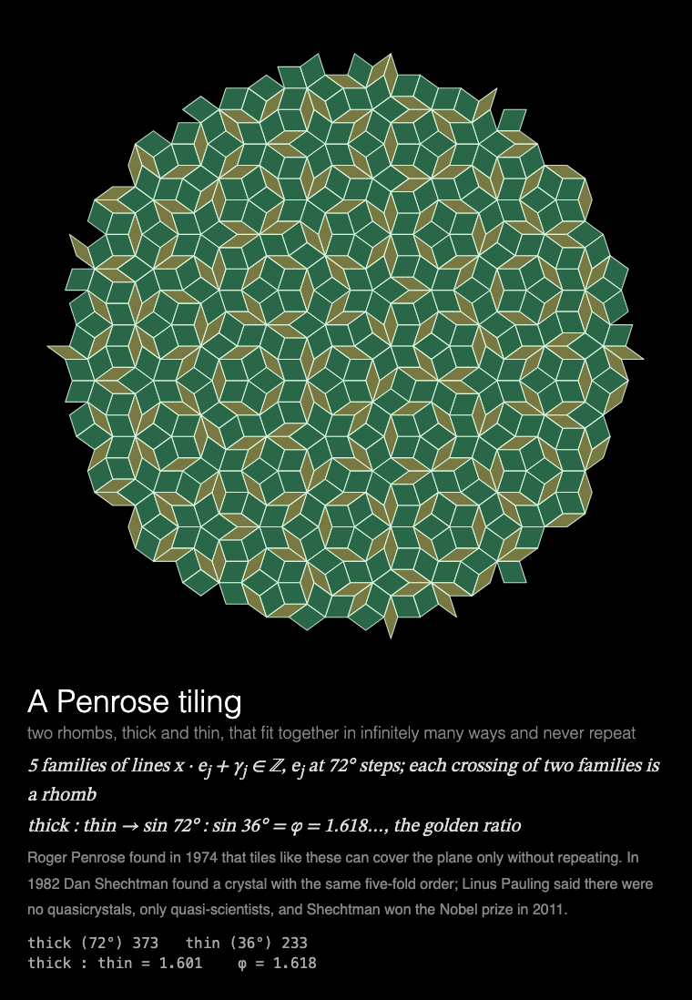

# MMM-Tilings

A [MagicMirror²](https://magicmirror.builders/) module that lays tilings that never repeat, tile by tile from the centre: Penrose's and its cousins, Escher's hyperbolic Circle Limit, and the hat.



Each time it is shown the module lays one of ten tilings, round and round from the centre in
22 s, then holds it: a Penrose tiling (a new one every time), the Ammann–Beenker, a heptagonal
or a dodecagonal one, Escher's *Circle Limit* (the hyperbolic plane in Poincaré's disc, five
ways), or the hat, the single tile found in 2022 that covers the plane only without repeating.
Underneath: what the tiles are, the rule that makes them, a short story, and live numbers: the
tiles of each kind counted as they are laid, their ratio closing in on φ for Penrose's, or how far
out into the hyperbolic plane the tiles have gone.

Built for a **Raspberry Pi 3 without GPU acceleration**: everything is drawn by the CPU, each
frame adds only the tiles just laid, the finished tiling costs next to nothing to hold, and the
animation stops completely while the module is hidden (see [Performance](#performance)).

## Installation

```bash
cd ~/MagicMirror/modules
git clone https://github.com/charleswest775/MMM-Tilings
```

No npm dependencies: nothing to install.

## Update

```bash
cd ~/MagicMirror/modules/MMM-Tilings
git pull
```

## Configuration

```js
{
	module: "MMM-Tilings",
	position: "middle_center",
	config: {
		cycleSeconds: 600,   // one tiling per showing, a new one each time the module is shown
		tilingsSeconds: 22,  // laid in 22 s of a 30 s page, then held
		width: 700,
		height: 700,
		fps: 12
	}
},
```

| Option | Default | Description |
|---|---|---|
| `tilingsSeconds` | `22` | Seconds to lay a tiling; then it holds |
| `cycleSeconds` | `600` | A new tiling this often while shown; there is always a new one each time the module is shown again |
| `width`, `height` | `700` | Canvas size in pixels |
| `fps` | `12` | Frame-rate cap; lower = less CPU |
| `showMath` | `true` | The caption under the canvas: title, the rule, a story and the live count of tiles |
| `turns` | `null` | `{ of: n, at: k }`: show only on every nth showing, from showing k (counting from 0), so modules sharing a page can take turns (see [Taking turns](#taking-turns)) |
| `statsPanel` | `false` | A line under the caption showing what the mirror spends: fps, CPU of Electron and the compositor, a bar per core, temperature. Sampled by the module's `node_helper` from `/proc`, only while the module is shown |
| `debugStats` | `false` | Show achieved fps and per-frame timings in the corner of the screen |

## Taking turns

Every page added to a rotation makes it longer. Modules can share a page instead and take turns:
with `turns: { of: n, at: k }`, modules on the same [MMM-pages](https://github.com/edward-shen/MMM-pages)
page each show on their own one in n showings. A module whose turn it isn't takes no room on the
page and costs nothing until the page comes round again.

Three kinds of figure that draw themselves and hold, one per showing:

```js
{
	module: "MMM-SacredGeometry",
	classes: "page-figures",
	position: "middle_center",
	config: { turns: { of: 3, at: 0 } }
},
{
	module: "MMM-Tilings",
	classes: "page-figures",
	position: "middle_center",
	config: { turns: { of: 3, at: 1 } }
},
{
	module: "MMM-PlanetsDance",
	classes: "page-figures",
	position: "middle_center",
	config: { turns: { of: 3, at: 2 } }
},
{
	module: "MMM-pages",
	config: { modules: [["page-home"], ["page-figures"]], rotationTime: 30000 }
},
```

Without `turns` the module works just as well on a page of its own, or in a normal region with
no MMM-pages at all: then it lays a new tiling every `cycleSeconds`.

## The tilings

Each showing lays one of ten tilings (a deck: all ten before any repeats), tile by tile round and
round from the centre in 22 s, and holds it:

- **Penrose, Ammann–Beenker, heptagonal and dodecagonal tilings**, by de Bruijn's multigrid
  (1981): n families of evenly spaced parallel lines (5, 4, 7 or 6), at random offsets, and one
  rhomb for each crossing of two lines, with sides along the two families' directions. Every
  showing is a new tiling. For Penrose's the offsets add up to 0, as his matching rules need;
  the readout counts the thick and thin rhombs, whose ratio closes in on φ, as the squares and
  rhombs of the Ammann–Beenker close in on 1 : √2.
- **Circle Limit**: the hyperbolic plane in Poincaré's disc, tiled by regular p-gons, q at each
  corner ({7,3}, {5,4}, {4,5}, {6,4}, {3,7}), built by reflecting the central one in its sides
  until the tiles are smaller than a pixel: every side a geodesic, an arc meeting the rim at
  right angles. Half the triangles into which each tile's centre, corners and midpoints cut it
  are shaded, as in the figure of Coxeter's that Escher saw in 1957. All the tiles are the same
  size; the readout says how far out the farthest is, and how many times smaller it has to be
  drawn there.
- **The hat** (`simulations/hat.js`), the einstein of Smith, Myers, Kaplan and Goodman-Strauss
  (2023), built by their substitution of four metatiles, after Kaplan's reference
  implementation: four rounds give 7,921 hats (89², as the rounds give 2², 5², 13², 34²: squares
  of Fibonacci numbers), of which a disc of ~600 is shown, coloured by the metatile each belongs
  to, the reflected ones apart. The readout counts them: unreflected to reflected close in on
  φ⁴ = 6.854.

The tests check that each is a tiling: no overlaps and no gaps (by sampling points), rhombs of
the right sides and areas, the golden ratio and √2 in large patches, hyperbolic tiles all
congruent (sides and circumradius equal in the hyperbolic metric, q at each corner), and the
hat's counts, congruence and ratio.

## Performance

Measured on a Raspberry Pi 3 B+ (Electron 42, software rendering, no GPU), as CPU of the
Electron processes plus the `cage` compositor, in % of one core (the Pi has four), 700×700 at
12 fps, over seven showings with the stats panel on:

| | % of one core | achieved fps |
|---|---|---|
| module hidden (e.g. another MMM-pages page); baseline mirror without it 0.2 | 0.3 | 0 |
| while tiles are laid (the first ~23 s) | ~33 | 12 |
| the finished tiling held | ~7 | 0 |
| over a 30 s showing, page change included | 37 (34–39) | |

Why it costs what it does:

- Everything is drawn by the CPU: the Pi 3's GPU can't run Chromium's accelerated canvas. Any
  frame that changes the canvas costs ~2% of a core per fps before drawing anything; on top of
  that, cost grows with the area that changes, since Chromium redraws the bounding box of
  everything touched in a frame. Laid in a spiral, a frame's new tiles lie together: on average
  about 1% of the canvas changes per frame, the least of any page in the family, so what the
  laying costs is mostly that fixed per-frame cost.
- The frame rate is capped (`fps`): the loop sleeps with `setTimeout` until a frame is due, and
  only then asks for an animation frame. JavaScript is not the bottleneck (a few ms per frame).
- Once the tiling is finished the module rests, polled only twice a second.
- While MagicMirror fades the module out nothing new is drawn, and once it is hidden the loop
  stops entirely.

## Development

```bash
node --test                  # tiling checks, no dependencies
python3 -m http.server       # in the module folder; then open http://localhost:8000/dev/preview.html
```

`dev/preview.html` runs the module outside MagicMirror², in a portrait 1200×1920 frame, with
hide/show buttons that follow MagicMirror's suspend/resume order. Query options override the
config, e.g. `?kind=hat` to lay that tiling (`penrose`, `ammann-beenker`, `heptagonal`,
`dodecagonal`, `hyperbolic-7-3`, `hyperbolic-5-4`, `hyperbolic-4-5`, `hyperbolic-6-4`,
`hyperbolic-3-7`, `hat`), `?tilingsSeconds=8&statsPanel=true`.

## License

MIT. The hat's substitution rules are from Smith, Myers, Kaplan and Goodman-Strauss,
*An aperiodic monotile* (2023); `simulations/hat.js` follows Craig Kaplan's reference
implementation.

Part of a family of MagicMirror² modules. Chaos, one simulation each:
[MMM-LorenzAttractor](https://github.com/charleswest775/MMM-LorenzAttractor),
[MMM-DoublePendulum](https://github.com/charleswest775/MMM-DoublePendulum),
[MMM-FractalBasins](https://github.com/charleswest775/MMM-FractalBasins),
[MMM-LogisticMap](https://github.com/charleswest775/MMM-LogisticMap),
[MMM-SymmetricIcons](https://github.com/charleswest775/MMM-SymmetricIcons),
[MMM-ThreeBody](https://github.com/charleswest775/MMM-ThreeBody),
[MMM-ChaoticBilliards](https://github.com/charleswest775/MMM-ChaoticBilliards),
[MMM-Rule30](https://github.com/charleswest775/MMM-Rule30),
[MMM-StandardMap](https://github.com/charleswest775/MMM-StandardMap),
[MMM-ChaoticWaterwheel](https://github.com/charleswest775/MMM-ChaoticWaterwheel) and
[MMM-Sandpile](https://github.com/charleswest775/MMM-Sandpile), or all eleven in
one module, [MMM-ChaosTheory](https://github.com/charleswest775/MMM-ChaosTheory).
And more pages of physics and mathematics:
[MMM-Atom](https://github.com/charleswest775/MMM-Atom),
[MMM-DoubleSlit](https://github.com/charleswest775/MMM-DoubleSlit),
[MMM-FractalZoom](https://github.com/charleswest775/MMM-FractalZoom),
[MMM-Chladni](https://github.com/charleswest775/MMM-Chladni),
[MMM-SacredGeometry](https://github.com/charleswest775/MMM-SacredGeometry),
[MMM-PlanetsDance](https://github.com/charleswest775/MMM-PlanetsDance),
[MMM-Harmonograph](https://github.com/charleswest775/MMM-Harmonograph),
[MMM-SnowCrystal](https://github.com/charleswest775/MMM-SnowCrystal),
[MMM-NightSky](https://github.com/charleswest775/MMM-NightSky) and
[MMM-PhotoDeck](https://github.com/charleswest775/MMM-PhotoDeck).
